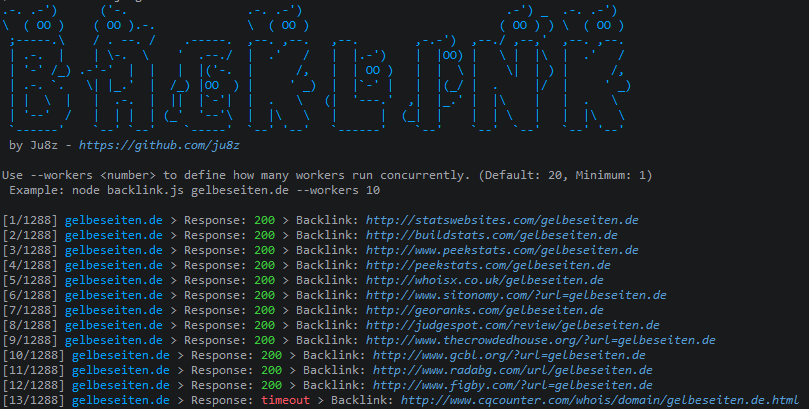

# Backlink

Backlink is a small Node.js CLI that checks a backlink list against your domain.
The current project is JavaScript only and runs through a single entry point:
`backlink.js`.



## What It Does

The tool reads backlink templates from `backlinks.json`. Those templates usually
contain the placeholder `gelbeseiten.de`.

When you run the CLI:

- It reads `backlinks.json`.
- It replaces `gelbeseiten.de` with the domain you pass in.
- It fetches each generated URL.
- It writes URLs with HTTP `200` responses to `completed.txt`.
- It writes everything else to `failed.txt`.

## Requirements

- Node.js 22+
- No third-party runtime dependencies

## Quick Start

```bash
git clone https://github.com/ju8z/backlink.git
cd backlink
node backlink.js example.com
```

## Usage

Run it with a domain:

```bash
node backlink.js example.com
```

Or let the CLI prompt you for one:

```bash
node backlink.js
```

You can also control concurrency:

```bash
node backlink.js example.com --workers 50
node backlink.js --workers 100
```

CLI rules:

- Only one positional domain is accepted.
- The worker flag must be written as `--workers <number>`.
- Worker count must be a positive integer.

## What You Will See

During a run, the CLI:

- Prints the banner.
- Shows the target domain in light blue.
- Shows HTTP `200` in green.
- Shows failed responses in red.
- Prints clickable backlink URLs in terminals that support OSC 8 hyperlinks.
- Prints clickable links to `completed.txt` and `failed.txt` in the summary.

Example output:

```text
[17/1287] example.com > Response: 200 > Backlink: www.some-site.com/example.com
```

## Files

- `backlinks.json`: Input source file for backlink templates.
- `completed.txt`: URLs that returned HTTP `200`.
- `failed.txt`: URLs that did not return HTTP `200`.
- `backlink.js`: CLI entry point.
- `package.json`: Package metadata.

## Input Format

`backlinks.json` must contain a JSON array like this:

```json
[
  {
    "url": "http://www.some-site.com/gelbeseiten.de"
  }
]
```

The loader checks only basic structure before requests start:

- The top-level value must be an array.
- Each entry must be an object.
- Each entry must contain a `url` field.
- Each `url` must be a non-empty string.

What it does not do:

- It does not run a separate valid-URL check before fetches start.
- It does not reject a malformed URL until runtime fetch handling reaches it.

## Project Structure

```text
src/
  application/
    services/
    use-cases/
  domain/
    errors/
    models/
    utils/
  interface/
```

`backlink.js` is the composition root and wires the CLI, repository, reporting,
and use-case classes together.

## Notes

- Default worker count is `20`.
- The runtime uses Node's built-in `fetch` with a 10 second timeout.
- Anything other than HTTP `200` is treated as a failed backlink.
- Backlink URLs without a scheme are normalized to `https://...` for terminal links.
- Higher worker counts can speed things up, but they can also increase timeouts or remote blocking.
